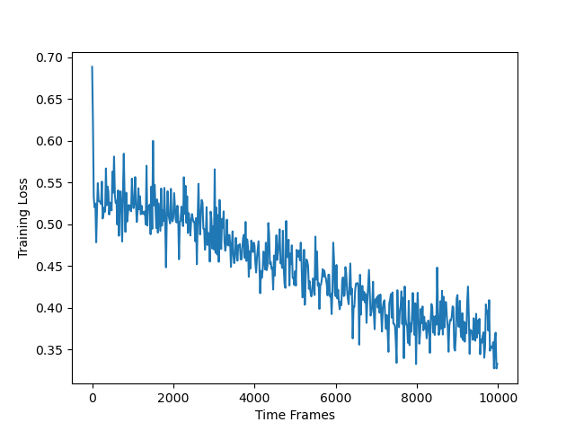
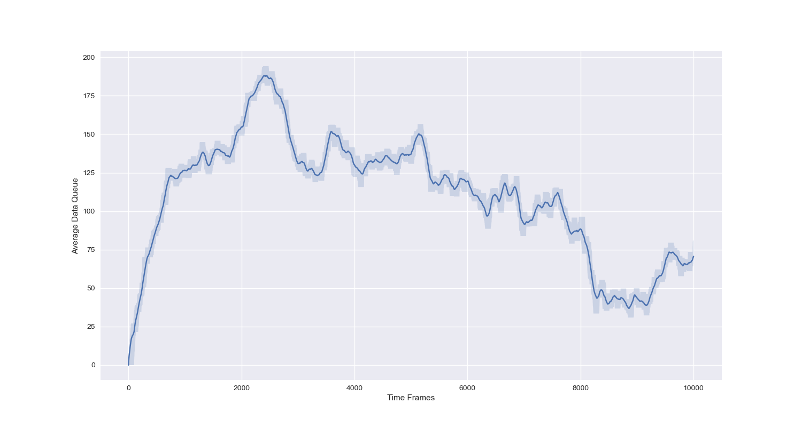
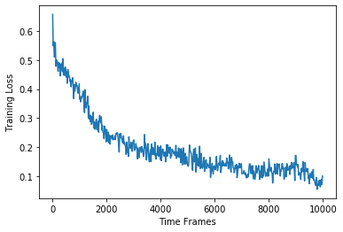
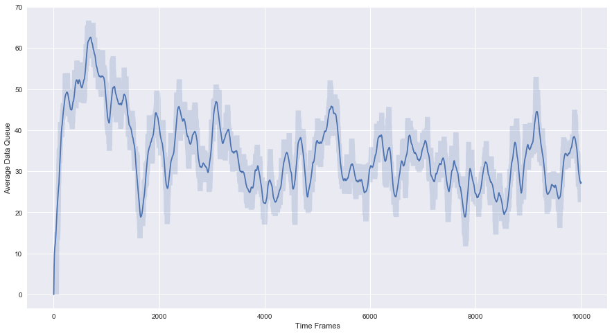

# LyDROO

*Lyapunov-guided Deep Reinforcement Learning for Stable Online Computation Offloading in Mobile-Edge Computing Networks*

PyTorch code to reproduce LyDROO algorithm [1], which is an online computation offloading algorithm to maximize the network data processing capability subject to the long-term data queue stability and average power constraints. It applies Lyapunov optimization to
decouple the multi-stage stochastic MINLP into deterministic per-frame MINLP subproblems and solves each subproblem via [DROO](https://github.com/revenol/DROO) algorithm. It includes:

- [memory.py](memory.py): the codes of Deep Reinforcement Learning based on fully connected neural networks (DNN) implemented on PyTorch.
- [memoryTF2conv.py](memoryTF2conv.py): the codes of Deep Reinforcement Learning based on convolutional neural networks (CNN) implemented on Tenforflow 2.

- [ResourceAllocation](ResourceAllocation.py): Algorithms for resource allocation.

- [LyDROO.py](LyDROO.py): run this file for LyDROO with DNN implemented on PyTorch, namely LyDROO (DNN).
- [LyDROOwithTF2conv.py](LyDROOwithTF2conv.py): run this file for LyDROO with CNN implemented on Tenforflow 2, namely LyDROO (CNN).

## Cite this work

1. Suzhi Bi, Liang Huang, and Ying-jun Angela Zhang, ``[Lyapunov-guided Deep Reinforcement Learning for Stable Online Computation Offloading in Mobile-Edge Computing Networks](https://ieeexplore.ieee.org/document/9449944)'', *IEEE Transactions on Wireless Communications*, 2021, doi:10.1109/TWC.2021.3085319.

```
@ARTICLE{bi2021LyDROO,  
  author={Bi, Suzhi and Huang, Liang and Wang, Hui and Zhang, Ying-Jun Angela},
  journal={IEEE Transactions on Wireless Communications},
  title={Lyapunov-guided Deep Reinforcement Learning for Stable Online Computation Offloading in Mobile-Edge Computing Networks},
  year={2021},
  volume={},
  number={},
  pages={1-1},
  doi={10.1109/TWC.2021.3085319}
}
```

## About authors

- [Suzhi BI](https://scholar.google.com/citations?user=uibqC-0AAAAJ), bsz AT szu.edu.cn

- [Liang HUANG](https://scholar.google.com/citations?user=NifLoZ4AAAAJ), lianghuang AT zjut.edu.cn

- [Ying Jun (Angela) Zhang](https://scholar.google.com/citations?user=iOb3wocAAAAJ), yjzhang AT ie.cuhk.edu.hk


## How the code works

- For LyDROO (DNN), run the file, [LyDROO.py](LyDROO.py). Please make sure that [PyTorch](https://pytorch.org/get-started/locally/) has been successfully installed before execution.

| Training Loss            |  Average Data Queue |
| :------------------------: | :------------------------: |
|  |  |


- For LyDROO (CNN), run the file, [LyDROOwithTF2conv.py](LyDROOwithTF2conv.py). Please make sure that [Tensorflow 2](https://www.tensorflow.org/install) has been successfully installed before execution.
|Training Loss            |  Average Data Queue |
| :-------------------------:|:-------------------------: |
|  |   |

- Remarks:
  - You may arrive at similar but different results since both wireless channels and data arrivals are randomly generated (on lines 130-139 of [LyDROO.py](LyDROO.py) and [LyDROOwithTF2conv.py](LyDROOwithTF2conv.py)).
  - LyDROO (DNN) requires more training frames before convegence, e.g., increase the time frame variable 'n' from 10000 to 20000 (on line 65 of [LyDROO.py](LyDROO.py)).
  - In general, LyDROO (CNN) converges much faster than LyDROO (DNN).
